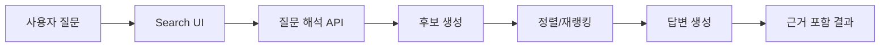

# dailyOS Natural Language Search Design

이 문서는 자연어 검색의 상위 설계 기준이다. 실제 구현 기준은 [src/features/search/natural-language-search/README.md](C:/Users/binfo/OneDrive/바탕%20화면/dailyOS/src/features/search/natural-language-search/README.md)와 그 안의 모듈을 따른다.

## 목표

- 사용자가 긴 키워드를 조합하지 않아도 기록을 찾을 수 있게 한다.
- 날짜, 사람, 장소, 금액, 건강, 사진, 활동을 문장 단위로 조회할 수 있게 한다.
- 답변은 반드시 근거 기록을 동반한다.
- 추측보다 정확한 근거를 우선한다.

## 기본 원칙

1. 원천 데이터는 바꾸지 않는다.
2. 자연어 검색은 새로운 데이터 저장소가 아니라 해석 계층이다.
3. 후보 검색은 결정론적으로 수행한다.
4. LLM은 해석과 요약에만 쓴다.
5. 응답에는 근거가 항상 포함돼야 한다.

## 사용자 경험

자연어 검색은 현재 `/m/search` 안에서 다음 두 모드를 제공하는 방식이 가장 자연스럽다.

- **키워드 모드**: 지금의 검색 경험을 유지한다.
- **질문 모드**: “지난주 누구랑 밥 먹었어?”, “이번 달에 운동한 날만 보여줘” 같은 문장형 검색을 받는다.

권장 흐름:

1. 사용자가 질문을 입력한다.
2. 화면이 질문에서 기간, 대상, 의도를 보정한다.
3. 검색 후보와 근거를 모은다.
4. 규칙 점수와 의미 벡터 유사도로 재정렬한다.
5. 짧은 요약 답변과 근거를 함께 보여준다.
6. 필요한 경우 추가 질문 버튼을 제안한다.

## 아키텍처



### 1. 질문 해석

질문에서 다음 정보를 뽑는다.

- 날짜 범위
- 사람 이름
- 장소 이름
- 금액/가계부 조건
- 건강/운동 조건
- 사진 여부
- 활동/계획 여부
- “무엇을 했는지”, “어디 갔는지”, “누구와 있었는지” 같은 의도

### 2. 후보 생성

후보는 현재 앱이 이미 만드는 통합 검색 인덱스를 최대한 재사용한다.

우선순위:

- `buildRecordSearchItems`로 만들 수 있는 전체 기록 아이템
- 날짜 필터
- 사람/장소/태그/금액/건강 키워드 필터
- 필요한 경우 더 좁은 기간의 DB 재조회
- 질문과 후보의 의미 유사도 계산

즉, 자연어 검색도 처음에는 “넓게 모으고, 나중에 좁히는” 방식이 좋다.

### 3. 재랭킹

후보를 점수화한다.

예시 점수 요소:

- 날짜 일치
- 월/주 범위 일치
- 질문에 나온 사람 이름 포함
- 장소 이름 포함
- 금액/카테고리 일치
- 질문 의도와 타입 일치
- 의미 벡터 유사도

재랭킹은 규칙 기반 점수와 임베딩 유사도를 섞는 하이브리드 구조가 좋다.
현재 구현은 로컬 semantic proxy를 쓰고, 나중에 서버 임베딩으로 바꿀 수 있게 분리한다.

### 4. 답변 생성

LLM이 할 일은 다음 둘이다.

- 후보 목록을 바탕으로 짧은 답변을 작성한다.
- 근거 기록을 읽기 쉬운 문장으로 묶어준다.

LLM이 해서는 안 되는 일:

- 없는 사실을 새로 만들기
- 근거 없는 날짜나 사람을 단정하기
- 후보에 없는 기록을 임의로 추가하기

## 응답 형식

API 응답은 사람이 읽기 쉬우면서도 화면 렌더링이 쉬운 구조가 좋다.

```ts
type NaturalSearchResponse = {
  query: string;
  interpreted: {
    dateRange?: { start?: string; end?: string };
    people?: string[];
    places?: string[];
    types?: string[];
  };
  answer: string;
  evidence: Array<{
    id: string;
    type: string;
    date: string;
    title: string;
    summary: string;
  }>;
};
```

## 서버 역할

자연어 검색은 서버 API로 분리하는 것이 좋다.

권장 API:

- `POST /api/search/natural`

서버가 맡을 일:

- Gemini 호출
- 결과 정형화
- 응답 길이 제한
- 안전한 키 보호

## 클라이언트 역할

클라이언트는 다음에 집중한다.

- 질문 입력
- 날짜 필터 보정
- 검색 결과 렌더링
- 근거 클릭 시 해당 날짜 화면으로 이동

## 구현 단위 제안

- `src/features/search/`
  - `natural-language-search/parser.ts`: 질문 의도와 범위 해석
  - `natural-language-search/embedding.ts`: 의미 벡터 생성
  - `natural-language-search/ranker.ts`: 점수화와 정렬
  - `natural-language-search/pipeline.ts`: 실행 흐름
  - `natural-language-search/types.ts`: 공통 타입
- `src/app/api/search/natural/route.ts`
  - 질문을 받아 답변 생성
- `src/features/screens/search/SearchView.tsx`
  - 키워드 모드와 질문 모드 전환

## 단계별 구현 순서

### Phase 1

- 현재 `SearchView`에 질문 입력 UI를 붙인다.
- 기존 `buildRecordSearchItems`를 후보 생성에 재사용한다.
- 규칙 기반 해석만으로 간단한 질문을 처리한다.

### Phase 2

- 서버 API를 추가한다.
- 질문 의도와 날짜 범위를 더 정확하게 파싱한다.
- 근거 카드와 요약 문장을 분리해서 보여준다.
- 의미 벡터는 서버 임베딩으로 교체 가능하게 유지한다.

### Phase 3

- Gemini를 붙여 답변을 더 짧고 자연스럽게 만든다.
- 추가 질문 제안을 자동화한다.
- 질문 히스토리와 즐겨찾기 질문을 고려한다.

## 실패 처리

- 질문이 너무 짧으면 예시를 보여준다.
- 후보가 없으면 “찾지 못했다”와 함께 기간 변경을 안내한다.
- 날짜가 애매하면 월/주 기준 보정을 제안한다.
- 결과가 너무 많으면 먼저 상위 근거만 보여주고 더보기로 넘긴다.

## 품질 기준

- 근거 없는 요약을 만들지 않는다.
- 같은 질문에 같은 결과가 재현돼야 한다.
- 검색 결과는 날짜와 타입이 분명해야 한다.
- 클릭했을 때 바로 원본 기록으로 이동할 수 있어야 한다.
